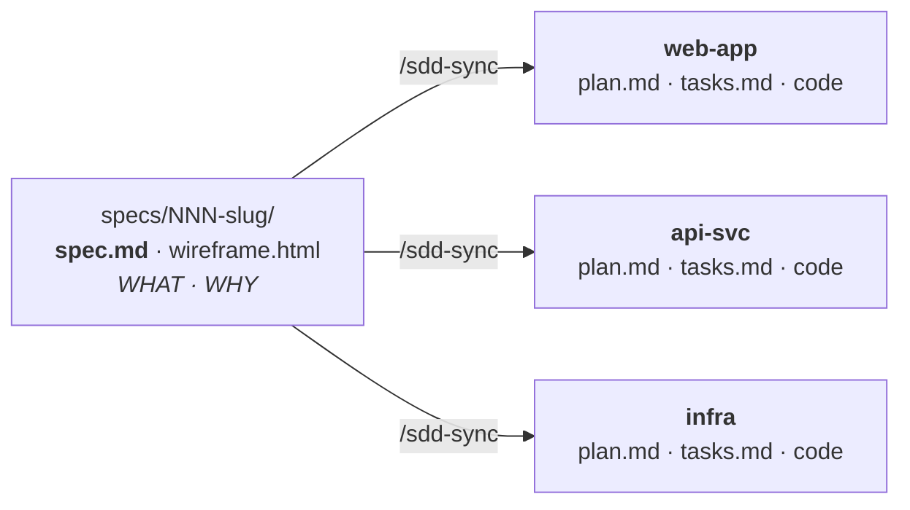
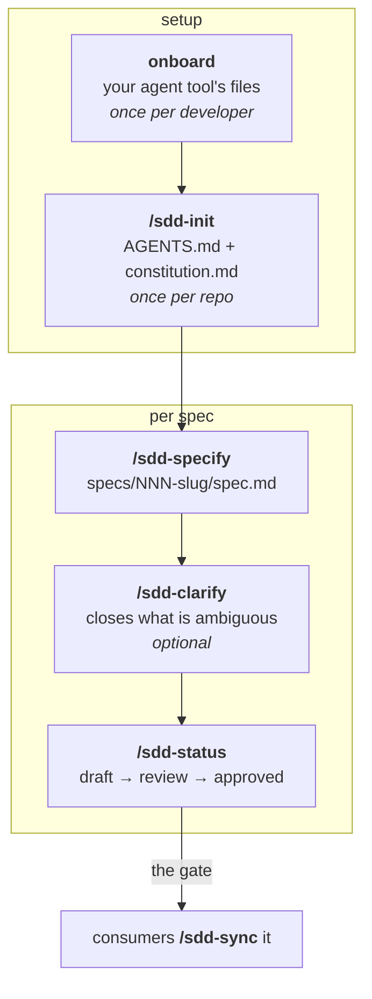
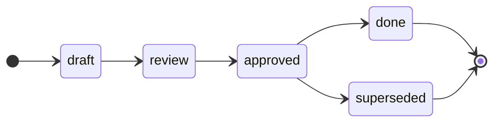

# SDD Spec Template — the Spec Repository

[](LICENSE)
[](https://github.com/cabu0124/sdd-spec-template/releases)
[](https://github.com/cabu0124/sdd-spec-template/generate)

> **Rule 1 — Specs Only, Spec First:** this repository holds WHAT and WHY.
> Plans, tasks and code belong to the repositories that build them.

A starting point for the **central source of truth for a product's business
specifications**. One spec per product story, technology-agnostic, consumed by
however many development repositories it takes to build.

> [!NOTE]
> **This file is for humans. Agents read `AGENTS.md`.**
> It documents *the template*, so `/sdd-init` replaces it with a README for your
> own product, written from `docs/templates/readme.md`.



Its counterpart is **[`sdd-project-template`](https://github.com/cabu0124/sdd-project-template)**,
which creates those development repositories. Both are the same Spec Driven Development method, split along the
one line that was always in it: WHAT is the product's, HOW is each repository's.

**Contents**

[Why a separate repository](#why-a-separate-repository) · [The loop](#the-loop) ·
[Bootstrap](#bootstrap) · [What a consumer does](#what-a-consumer-does) ·
[Layout](#layout) · [Lifecycle](#lifecycle) · [Any agent](#any-agent) ·
[License](#license)

---

## Why a separate repository

A product story is transversal; its code is not. One feature is a screen in the
frontend, an endpoint in the backend and a rule in a worker — three repositories,
three plans, three task lists, and exactly **one** statement of what the product
must do.

Put that statement in one of the three and the other two either copy it and drift
or narrow it until it no longer describes the product. Put it here and there is
one document, one status, one place to ask a question, and one place a
correction has to be made.

| | This repository | A development repository |
| --- | --- | --- |
| Owns | `spec.md`, `wireframe.html`, status, product docs | `plan.md`, `tasks.md`, code, contracts |
| Answers | WHAT · WHY | HOW · WHERE · WHEN |
| Knows about | the product | one codebase |
| Never holds | a plan, a task list, an endpoint, a schema | a second version of the spec |

## The loop



| # | Command | What it does | Notes |
| --- | --- | --- | --- |
| 1 | `onboard` | Your agent tool's adapter and command files — follow [`docs/commands/onboard.md`](docs/commands/onboard.md) | once per developer |
| 2 | `/sdd-init new\|existing` | Fills `AGENTS.md`, `docs/constitution.md`, `README.md` | once per repo |
| 3 | `/sdd-adopt <path>` | Carries a spec over from a previous system | optional |
| 4 | `/sdd-specify` | WHAT and WHY (+ wireframe, if it has screens) | |
| 5 | `/sdd-clarify` | Closes what the spec leaves ambiguous, and amends an approved one | optional |
| 6 | `/sdd-status <NNN> <status>` | Moves the spec through its lifecycle, and says who must re-sync | the gate |

There is no `/sdd-plan`, no `/sdd-tasks`, no `/sdd-implement` here — and that
absence is the design. They exist, unchanged, in
[`sdd-project-template`](https://github.com/cabu0124/sdd-project-template).

**A command is an interactive workflow, not a canned prompt.** Each one reads the
repository and the existing artifacts first, asks only what it cannot work out
from them, writes its artifact, and stops. The workflows live in
[`docs/commands/`](docs/commands/), one file per command, and that file is the
whole definition —
the per-tool command files are pointers into it, generated by `onboard`.

## Bootstrap

1. **Copy this template** into the new repository.
2. **Set up your agent tool.** Point it at [`docs/commands/onboard.md`](docs/commands/onboard.md) and follow
   it. It asks which tools you use and generates their adapter and `sdd-*`
   command files — all `.gitignore`d. *Each developer does this once.*
3. **Run `/sdd-init new`**, or **`/sdd-init existing`** if there are already
   specs or product documents to fold in. It fills `AGENTS.md`,
   `docs/constitution.md` and this README, and records who consumes these specs.
4. **Run `/sdd-specify <what the product needs>`** for the first spec.

## What a consumer does

A repository created from `sdd-project-template` points at this one in a single
committed file:

```yaml
# .sdd/config.yml, in the development repository
spec_repo:
  name: acme-specs
  path: ../acme-specs                        # tried first; needs no network
  remote: git@github.com:acme/acme-specs.git # fallback
  ref: main                                  # a branch to track, or a tag to pin
  specs_dir: specs
  mirror: [spec.md, wireframe.html]
```

Then, there:

| Command, there | What it does |
| --- | --- |
| `/sdd-sync 014-password-reset` | `spec.md` copied in, byte for byte, plus `spec.link.yml` |
| `/sdd-plan 007` | HOW that repository builds it |
| `/sdd-tasks 007` | its own commit-sized units |
| `/sdd-implement 007` | one task per run |

Three things make that safe, and all three are stated in
[`docs/consumers.md`](docs/consumers.md):

- **The mirror is read-only.** `spec.link.yml` carries a `sha256` per file, and
  the consumer's own `/sdd-sync`, `/sdd-analyze` and `spec-mirror` job check it.
- **The spec is never narrowed per repository.** Which repository builds which
  part is drawn in *their* `plan.md` → `## Scope in this repo`.
- **Questions come back here.** `/sdd-clarify`, so the answer reaches everyone.

> [!IMPORTANT]
> A spec edited downstream is fixed for one repository and for nobody else. The
> product then has as many versions of what was agreed as it has repositories —
> which is the single failure this whole split exists to prevent.

Ids need not match: `014-password-reset` here can be `007-password-reset` there.
The slug is the join key; `spec.link.yml` records the mapping.

A complete run of both templates together — writing the spec here, consuming it
there, planning, tasks, implementation, and what happens when the spec later
changes — is in
[`docs/example.md`](https://github.com/cabu0124/sdd-project-template/blob/main/docs/example.md)
of `sdd-project-template`.

## Layout

<details>
<summary><b>The whole repository, file by file</b> — reference, not narrative.</summary>

```text
AGENTS.md              source of truth — the only file loaded every session
README.md              this file — /sdd-init replaces it with your product's own
LICENSE                MIT — replace it in the repository you create
.gitignore             keeps the per-developer agent files out of version control
.github/
  CODEOWNERS           who reviews a spec, a principle or the lifecycle
  workflows/           pr-title.yml · release.yml — tags consumers can pin to
                       specs-index.yml — statuses valid, index in step, specs only
docs/
  commands/            the six workflows, one file per command (incl. onboard)
  constitution.md      durable principles; read when a spec is silent
  lifecycle.md         statuses, amendments, versions, releases
  consumers.md         the contract with development repositories
  product/             glossary and product documentation
  templates/           spec.md · wireframe.html · index.md
                       readme.md — the product README, written by /sdd-init
specs/
  INDEX.md             every spec, its status, its consumers
  NNN-slug/
    spec.md
    wireframe.html     only when the feature has screens
scripts/
  sdd-onboard.sh       deterministic generator for local agent adapters
  sdd-doctor.sh        offline diagnosis of tools and agent adapters
  spec-check.sh        validates spec structure and lifecycle gates
  test-spec-check.sh   exercises the validator contract with isolated fixtures
  spec-index.sh        generates and checks the catalog
  sdd-check.sh         portable local and CI entry point
```

That is the whole repository. `onboard` adds, **outside version control**, the
adapter your tool needs and its `sdd-*` command files.

</details>

Specs are numbered `NNN-slug`, zero-padded, **never reused and never
renumbered** — the number is the permanent id in commits, branches, issues and
every consumer's `spec.link.yml`.

## Lifecycle



A development repository builds against a **published** spec: `approved`, or
`done` once the work was delivered. Their `/sdd-plan` refuses `draft` and
`review`, which are still being written, and `superseded`, which the successor
replaced. **Only the user approves**, and `## Open questions` must be empty
first.

An approved spec is **published**: consumers have mirrored it. Changing it means
an amendment line and a word about who has to re-sync — and when the decision
itself changed, a new spec that supersedes it rather than a rewrite of what
somebody already built. Full rules in [`docs/lifecycle.md`](docs/lifecycle.md).

## Any agent

Claude Code, Copilot, Antigravity, Cursor, Codex, Gemini CLI, Windsurf, Zed,
Aider — the method does not care which one you use.

**[`AGENTS.md`](AGENTS.md) is the source of truth.** The template ships nothing tool-specific:
most agents read `AGENTS.md` natively, and the four that need an adapter get a
thin one that points at it and repeats only the `Rule 1` block. Those adapters
and the per-tool command files are generated per developer by
[`docs/commands/onboard.md`](docs/commands/onboard.md) and are `.gitignore`d.

> [!TIP]
> A team that *does* want to share one deletes its line from `.gitignore` and
> commits it.

## License

MIT — see [`LICENSE`](LICENSE). Copy it, change it, ship it.

A repository created from this template inherits the file. Replace it with your
own: the licence of your product's specifications is your decision, not this
template's.
